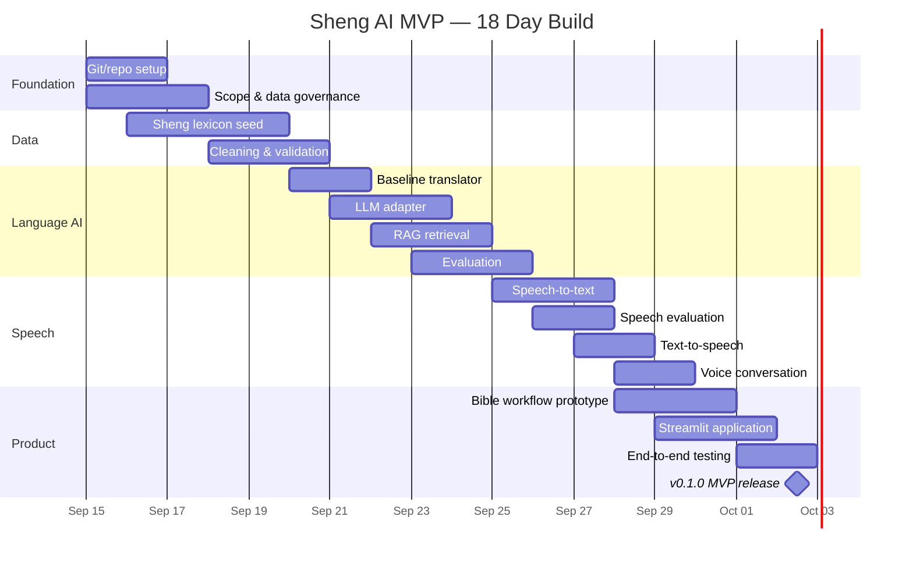

# Sheng AI MVP

An 18-day MVP for a Sheng ↔ Swahili ↔ English AI system with vocabulary retrieval, translation, speech-to-text, text-to-speech, and a rights-aware Bible translation-assistant prototype.

## Product goal

Build a working demonstration that can:

1. understand common Sheng words and phrases;
2. translate Sheng, Swahili, and English;
3. retrieve definitions and examples from a curated Sheng lexicon;
4. accept speech and return text;
5. speak model responses;
6. demonstrate a controlled, human-reviewed Scripture translation workflow;
7. preserve source/provenance and usage-rights metadata for every dataset record.

> This repository intentionally does **not** include unrestricted Facebook/TikTok scraping. Social data ingestion must use authorized APIs, creator licensing, public-domain/licensed sources, or explicit permission, with provenance retained.

## 18-day plan



## Repository layout

```text
sheng-ai/
├── app/                    # Streamlit UI
├── data/
│   ├── raw/                # local-only by default
│   ├── interim/
│   ├── processed/
│   └── evaluation/
├── docs/                   # scope, governance, architecture, evaluation
├── models/                 # local model artifacts (not committed)
├── notebooks/
├── src/
│   ├── bible/
│   ├── data/
│   ├── rag/
│   ├── speech/
│   └── translation/
└── tests/
```

## Quick start

```bash
python -m venv .venv
source .venv/bin/activate   # Windows: .venv\\Scripts\\activate
pip install -r requirements.txt
python src/data/clean_data.py
streamlit run app/streamlit_app.py
```

## Git workflow

Use `main` for releasable code and short-lived feature branches, for example:

```bash
git checkout -b feature/sheng-dataset
# work
git add .
git commit -m "Expand Sheng vocabulary seed"
git push -u origin feature/sheng-dataset
```

Recommended branch families:

- `feature/data-*`
- `feature/translation-*`
- `feature/rag-*`
- `feature/speech-*`
- `feature/bible-*`
- `feature/app-*`
- `fix/*`

## Data rule

Every training/evaluation row should answer: **where did it come from, who owns it, may we use it for model development, and may we use it commercially?**

## Execution backlog

The day-by-day acceptance plan is in [`docs/18_day_tasks.md`](docs/18_day_tasks.md). A GitHub-importable task list is in [`.github/project_tasks.csv`](.github/project_tasks.csv).

## Current status

- [x] Day 1 repository foundation
- [x] Day 2 governance skeleton
- [x] Day 3 lexicon schema
- [x] Day 5 cleaning pipeline scaffold
- [x] Day 6 baseline translator scaffold
- [x] Day 8 local RAG scaffold
- [x] Day 11 STT adapter scaffold
- [x] Day 13 TTS adapter scaffold
- [x] Day 15 Bible rights gate scaffold
- [x] Day 16 Streamlit scaffold
- [ ] Native-speaker review of seed lexicon
- [ ] Choose/connect production LLM
- [ ] Collect licensed/consented corpus at useful scale
- [ ] Run translation and speech evaluations
